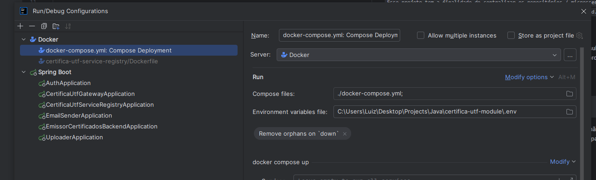

## Certifica UTF Module

`Esse projeto tem a finalidade de centralizar os repositórios / microsserviços que possuem alguma dependência e são necessários para a execução do back-end.`

### Inicializar workspace

Para o gerenciamento e administracao dos repositorios esta sendo utilizado o submodules do git.
Dessa maneira para criar o arquivo .gitmodules baseado nos forks dos projetos do desenvolvedor foi optado por criar um .bat

- Execução
```
./init-workspace <FORK_NAME>
```
Assim vai ser executado o clone de todos os projetos necessários.
Caso você não tenha o fork de algum desses projetos vai ocorrer erro.
Os projetos seram clonados na pasta `services`

### Variaveis de ambiente

Os projetos necessitam de variáveis de ambiente para algumas funcionalidades,
como por exemplo autenticação. Uma alternativa para simplificar a adição das variáveis de desenvolvimento
e a criação de um arquivo .env dentro do certifica-utf-module, passando assim esse arquivo na inicialização do compose ou diretamente.

- Exemplo



### Docker compose

Se preferir executar os projetos com o docker, existe um arquivo docker-compose.yml dentro da pasta services,
ele utiliza os projetos locais para execução dentro dos containers.

- Execução

```
docker-compose up
```


